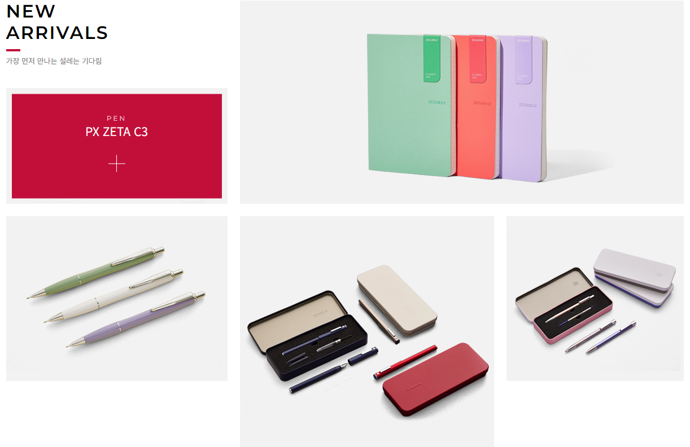
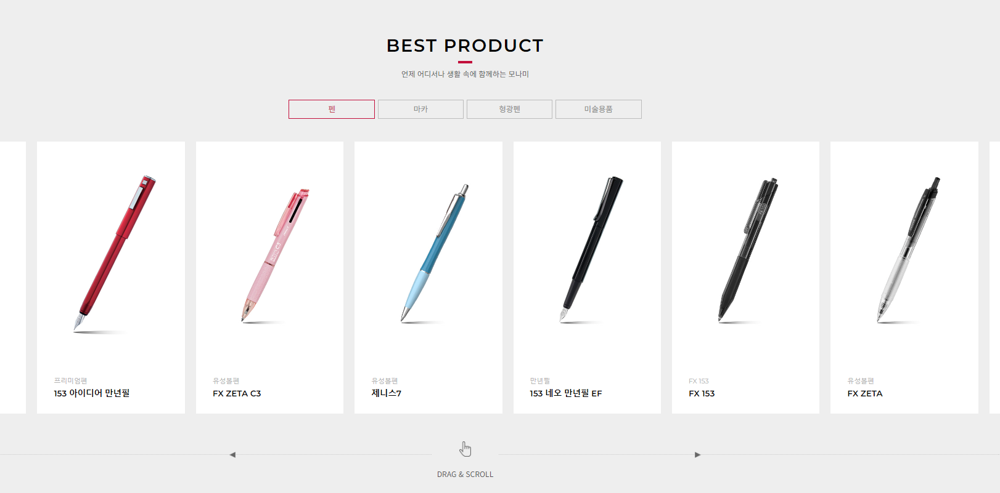
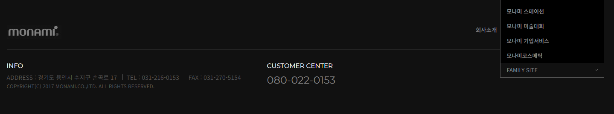

# 🖊️ 모나미 클론코딩

- #### [모나미 원본](http://www.monami.com/index.php)
- #### [모나미 클론 코딩](https://genuine-sable-47a49f.netlify.app)

## 📌 선택 방법

- 저번주에 진행한 **스타벅스 예제**와 비슷한 사이트
- swiper와 scrollmagic을 사용하는 사이트
- 동영상을 제공하는 사이트
- 깔끔한 사이트

## 💡 구현 방법

- 총 8개의 Section으로 구성
  - HEADER, VISUAL, ARRIVALS, PRODUCT, VIDEO, NEWS, SUBDISIARY, FOOTER
- HTML과 CSS 위주로 구성
  - JS는 classList 속성과 Swiper, ScrollMagic만 사용해 최소화
- Flex, Grid 활용
  - Grid보단 Flex를 사용하려고 노력
  - Sub Menu, GNB, LNB, NEW ARRIVALS 등
- BEM 방법론
  - BEM 방법론을 사용하긴 했으나 잘못 사용했을지도...

## 💻 구현

### 1. HEADER

- 크게 두 개로 나눠 구성
- 상단에는 언어 변경 · SNS · Sub Menu로 구성, 하단에는 로고 · GNB · LNB · 검색 · 전체 메뉴로 구성
- Flex를 이용해 LNB 구성, `max-height`와 `hover`를 이용해 슬라이드 애니메이션 구현
- Popup 구현, X를 누르면 display를 none으로 줘서 닫음

### 2. VISUAL

- 이미지 위에 글씨는 postion을 absolute로 줘서 배치

### 3. ARRIVALS

- 위와 아래로 div로 나눠서 Flex를 이용해 구성
- align-items를 flex-end와 flex-start로 줘서 배치

### 4. PRODUCT

- 4개의 카테고리로 구성
- Swiper를 이용해 슬라이드 시 item이 보이도록 구성
- JS에서 classList를 사용해 class가 없는 div를 display:none

### 5. VIDEO

- Scroll이 Video의 절반 정도 왔을 때 재생, 빠져 나갈 때 정지
- video 태그와 ScrollMagic을 사용

### 6. NEWS

- 3개의 영역으로 구성
- Flex를 사용해 배치

### 7. SUBDISIARY

- Flex를 사용해 배치
- justify-content를 space-between으로 줘서 간격에 맞춰 정렬

### 8. FOOTER

- 상단과 하단으로 나눠 구성
- 하단에 있는 ComboBox는 header 섹션에 있는 언어 변경과 거의 동일
- Select 태그 대신 ul, li 태그를 이용하여 만듦

## ❌ 아쉬운 점

- SCSS도 사용해 봤으면 좋았을 것 같다.
- grid를 아예 사용하지 않았다.
- NEWS 섹션에 있는 왼쪽 영역이 원본에선 크기가 줄면 정해진 크기로 바뀌면서 줄어드는데 css만으로 구성을 어떻게 해야 할지 몰라 구성하지 못했다.
- SUBDISIARY 섹션에 있는 이미지에 마우스를 올리면 border가 바뀌는데 이때 이미지가 움직이는 현상이 있다. space-between을 썼기 때문인 것 같아서 이미지 안에 공간을 주고 중앙 배치를 시켜보려 했으나 안 돼서 시간상 포기했다.
- 웹을 바로 내리면 동영상이 바로 시작이 안 되는 것 같다. 로딩이 있어 보이는 것 같아 이건 더 찾아봐야 할 것 같다.

## 📖 이후

- [ ] SCSS 공부
- [ ] BEM 방법론
- [ ] 반응형 웹
- [ ] grid 공부
- [ ] jQuery 공부
- [ ] 이 후에는 스크롤 시 한 섹션씩 이동하는 웹 페이지를 만들어보고 싶다. ( fullPage 라이브러리 )
